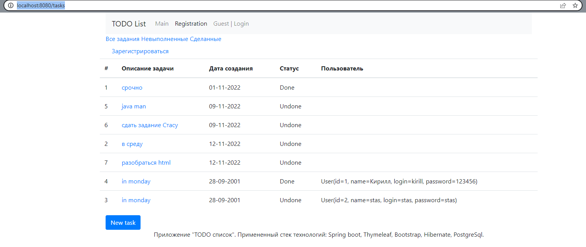
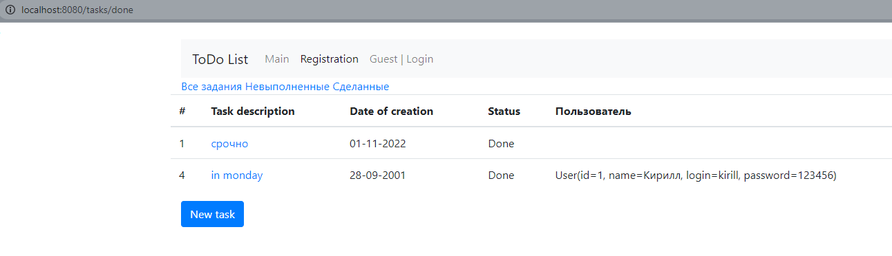
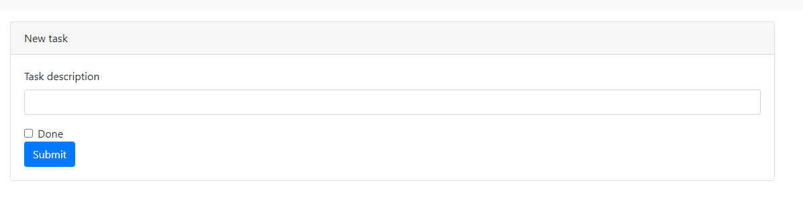
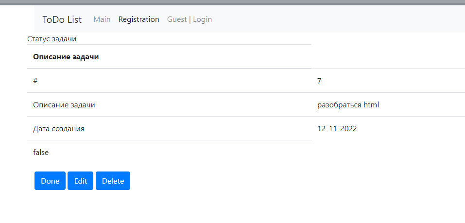

# job4j_todo

## Приложение "TODO list"

Это веб-приложение TODO List. Есть список заданий.

Приложение позволяет:

- добавлять задачи в список
- удалять задачи
- помечать задачи как выполненные
- редактировать задачи -отображать
- завершенные/незавершенные задачи отдельными списками

## Использованные технологии


Перед запуском установите:

- Java 17
- Apache Maven 3.x
- PostgreSQL 14

## Запуск приложения

1. Создать бд:

```sql
    create database todo;
```

2. Запуск приложения с maven. Перейдите в корень проекта через командную строку и выполните команды:

```
    mvn clean install
    mvn spring-boot:run
```

3.поменять login/password в файлах src/main/resources/db.properties и src/main/resources/hibernate.cfg.xml на требуемый


## Examples

Список всех задач (завершенных/незавершенных)

Список завершенных задач

Список новых задач

При нажатии на кнопку "Изменить задачу" происходит переход в меню редактирования задачи


### Контакты:

email: kavalerov24@gmail.ru