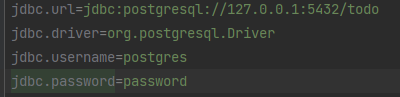
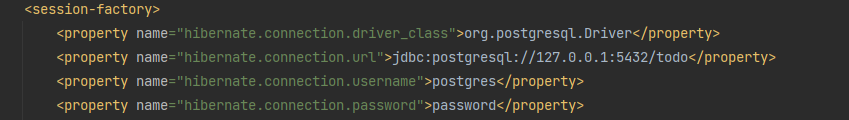
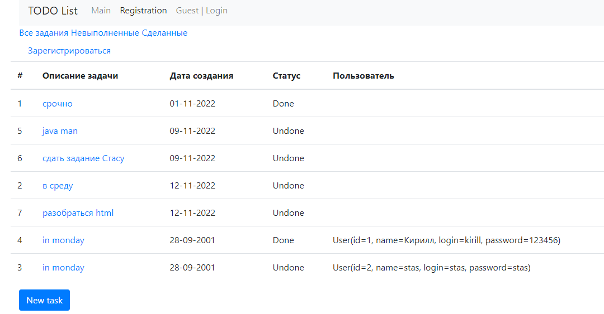
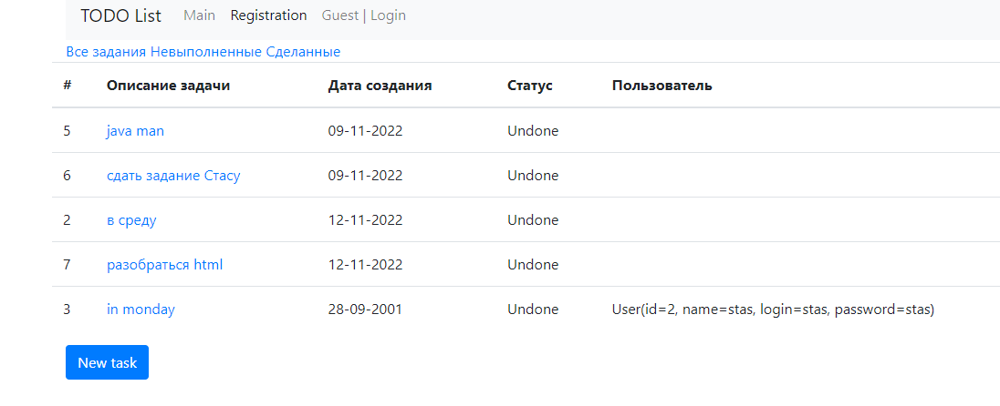
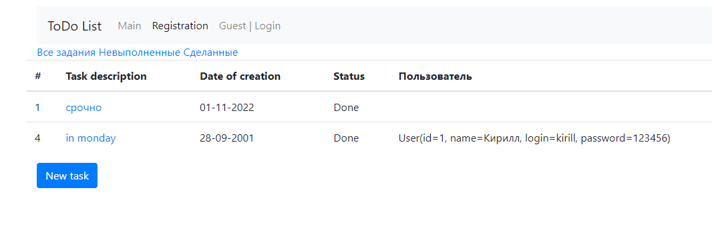

# job4j_todo

## Приложение "TODO list"

Это веб-приложение TODO List. Есть список заданий.

Приложение позволяет:
- добавлять задачи в список
- удалять задачи 
- помечать задачи как выполненные
- редактировать задачи -отображать
- завершенные/незавершенные задачи отдельными списками

## Использованные технологии

- Java 17
- Maven 3.1.2
- Spring boot 2.7.3
- PostgreSQL 42.3.6
- Liquibase 4.15.0
- Hibernate 5.6.11.Final
- Lombok 1.18.22
- Thymeleaf
- Bootstrap

## Перед запуском проекта:

- создать базу данных с именем todo
- поменять login/password в файлах src/main/resources/db.properties и src/main/resources/hibernate.cfg.xml на требуемый
  
  

## Запуск приложения:

- запустить метод main в классе src/main/java/ru/job4j/todo/Main.java
- после запуска сервера перейти на адрес: http://localhost:8080/tasks

##Examples

